# GreenBin Media Documentation

This folder contains multimedia resources related to the development of the GreenBin smart waste sorting system.

---

# 1. CAD Design

## SolidWorks Concept Design

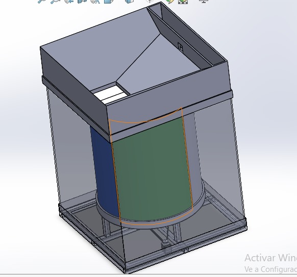

Initial CAD prototype of the GreenBin smart waste sorting system developed in SolidWorks.

---

# 2. Embedded System and Electronics

## NVIDIA Jetson Nano Integration

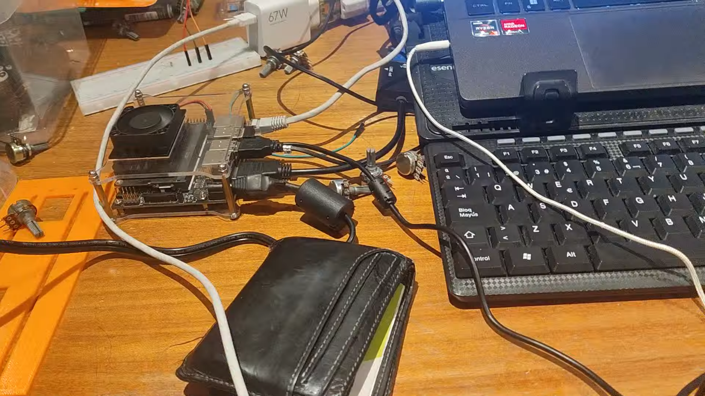

Embedded AI computer used for computer vision inference and communication with the control system.

---

## IBT-2 Motor Driver

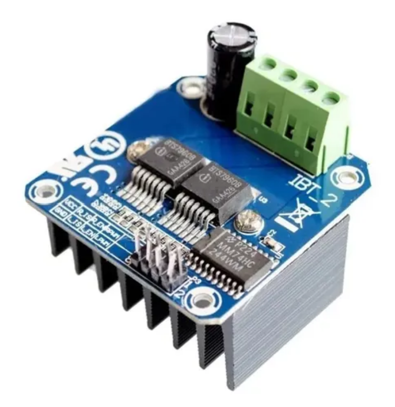

High-current motor driver used for actuator and motion control.

---

## Power Distribution and Embedded System

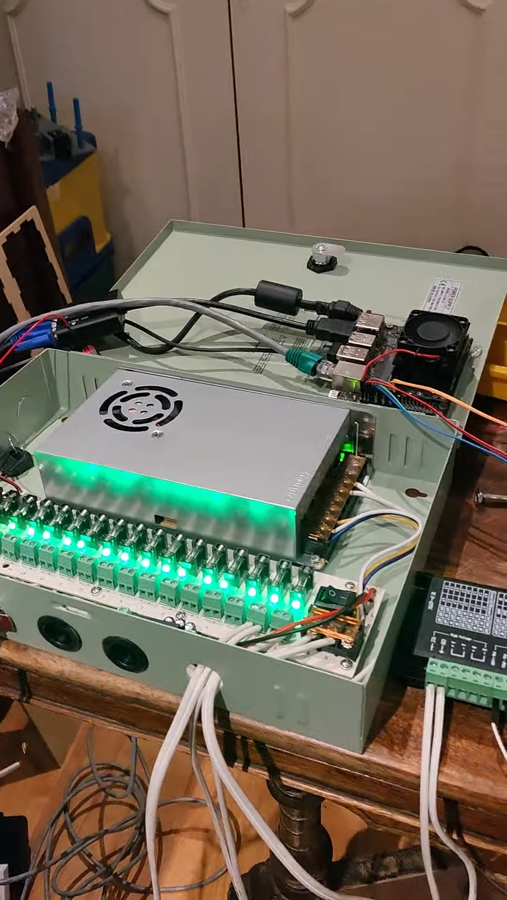

Power distribution and embedded integration system connecting drivers, actuators, and Jetson Nano.

---

## YX850 Relay Module


Relay module used for switching and actuator control.

---

## Emergency Energy and Fuse System

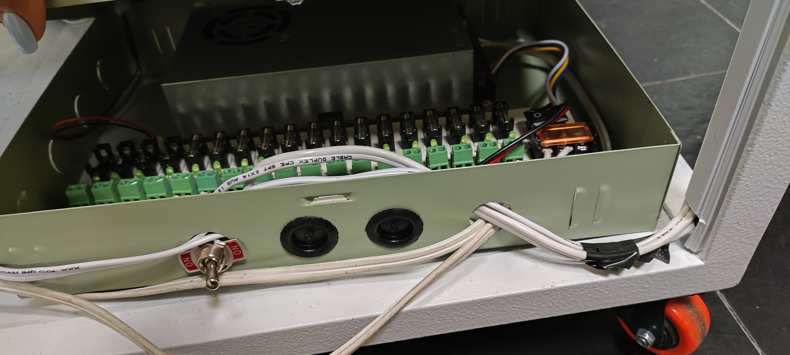

Electrical protection and emergency power distribution system.

---

# 3. Mechanical Components

## Linear Actuator

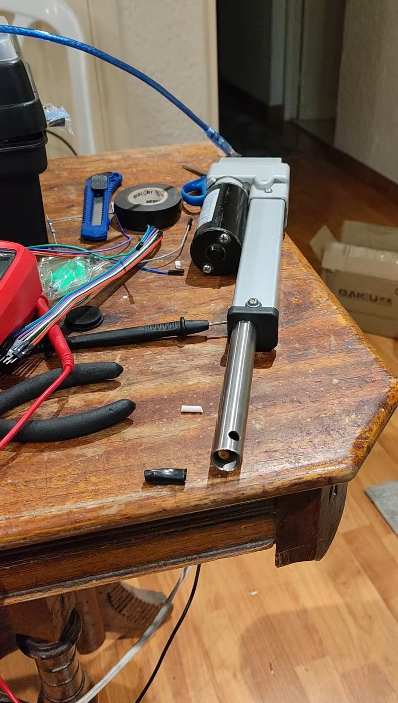

Linear actuator responsible for gate opening and movement control.

---

## Stepper Motor and Pulley Mechanism

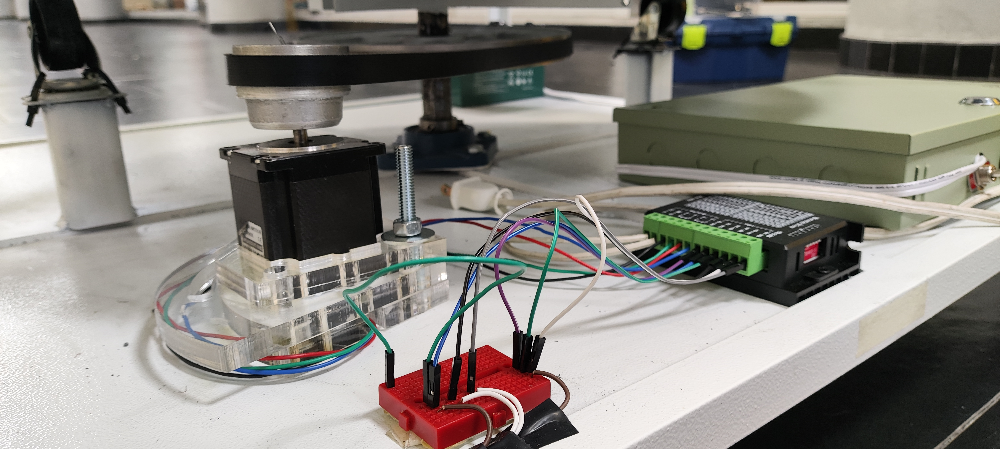

Mechanical transmission system based on pulleys and stepper motor positioning.

---

## Pulley Assembly

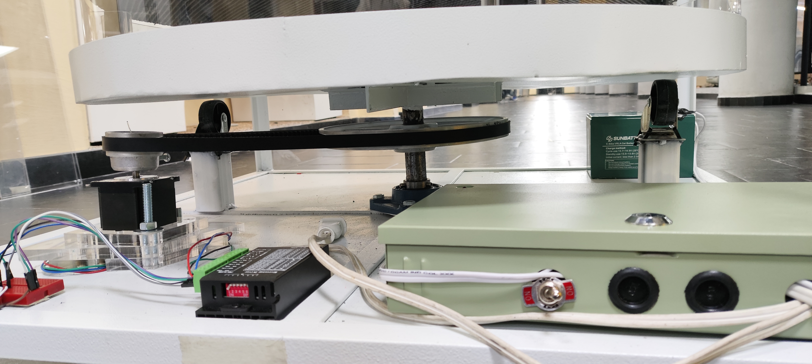

Pulley mechanism used for rotational positioning.

---

# 4. Computer Vision Development

## Camera Prototype

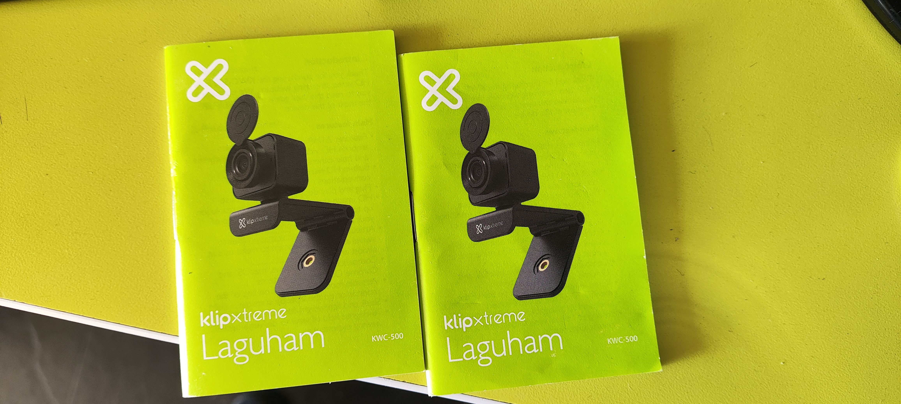

Initial computer vision camera configuration tests.

---

## GreenBin Detection Environment


Computer vision testing environment for waste detection and classification.

---

# 5. System Logic and Workflow

## Whiteboard Development Diagram

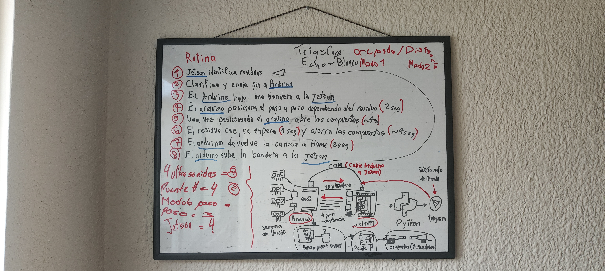

Development workflow and communication logic between Arduino, Jetson Nano, sensors, and actuators.

---

## Digitized Logic Diagram

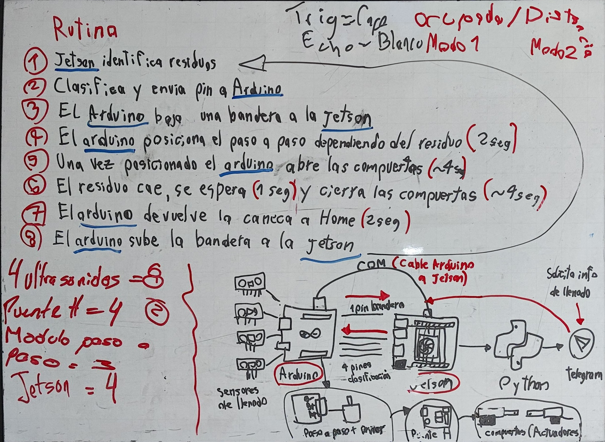

Digitized version of the control logic and system architecture.

---

# 6. Mechanical Construction

## Structural Construction Phase

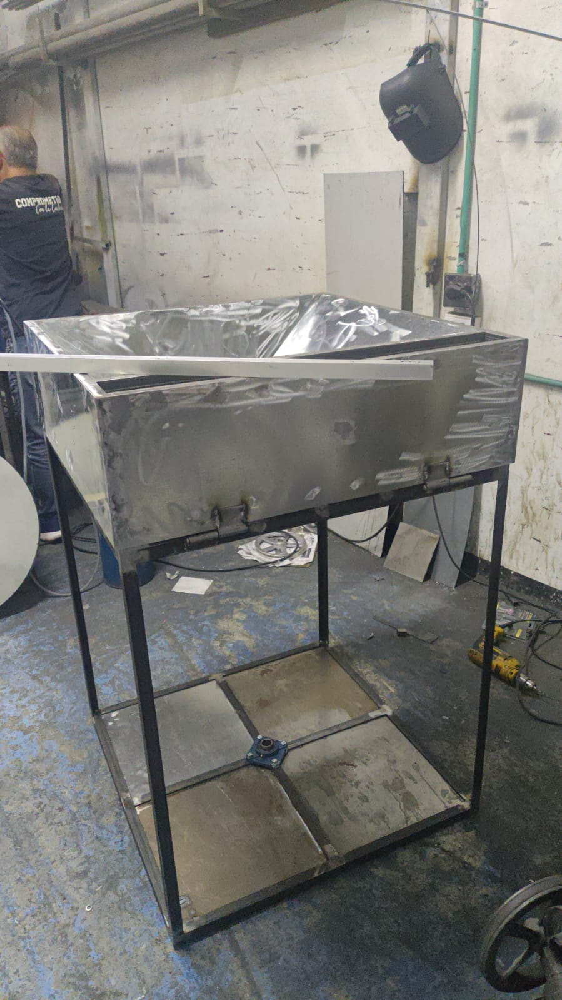

Mechanical assembly and fabrication process of the GreenBin structure.

---

## Acrylic Leachate System

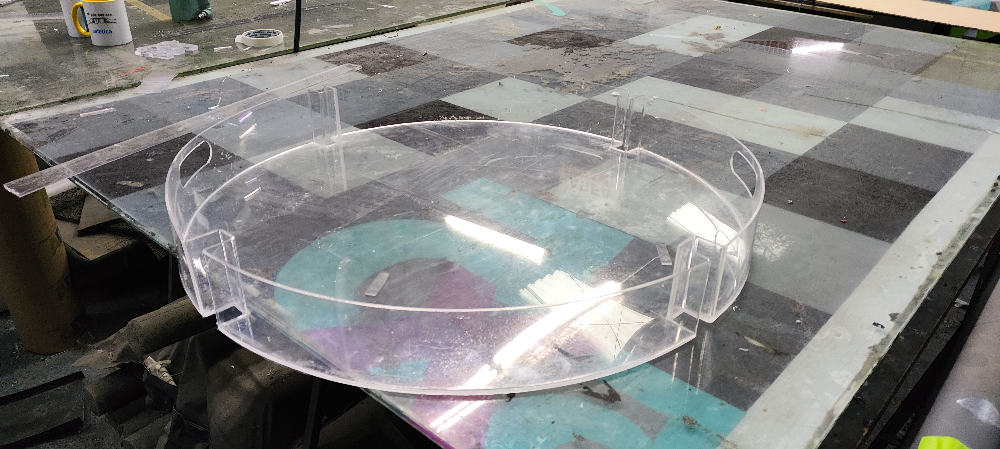

Acrylic structure designed for leachate management.

---

# 7. Object Detection Tests

## Tape Detection

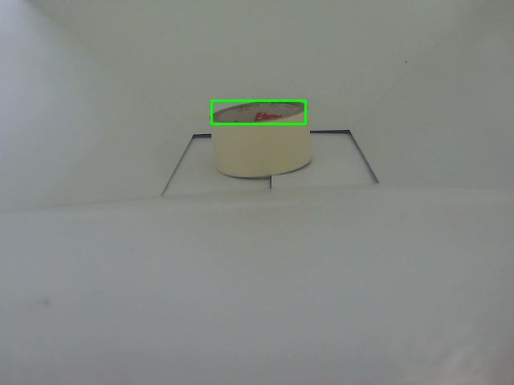

Computer vision detection test using adhesive tape.

---

## Jumper Wire Detection

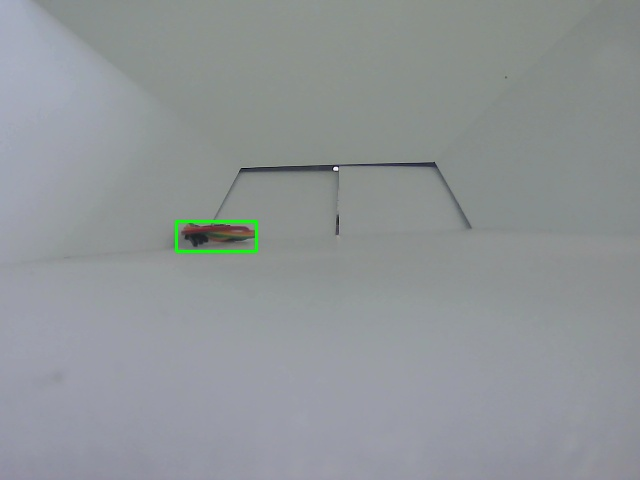

Detection and tracking of jumper wires.

---

## Orange Detection

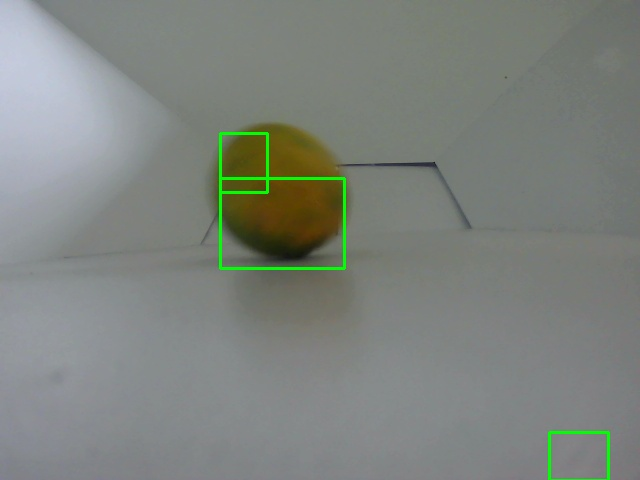

Object classification and detection test using an orange.

---

## Sponge Detection

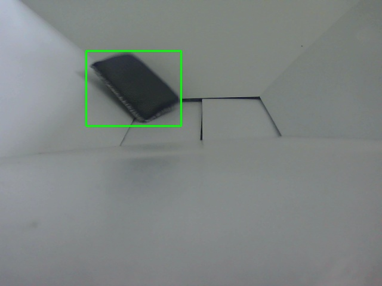

Detection test using a sponge object.

---

## Can Detection

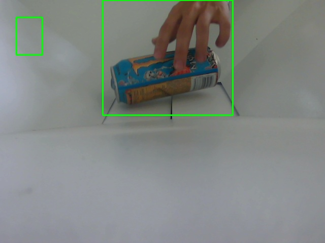

Metal can object detection test.

---

## Coffee Container Detection


Detection and localization of a coffee container.

---

## Syringe Detection

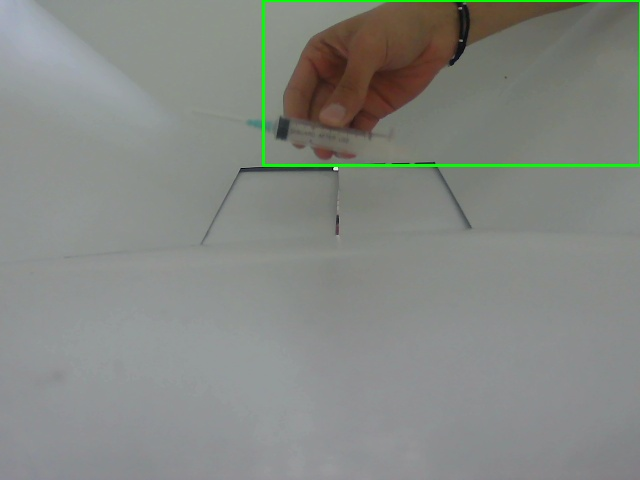

Detection test for syringe-shaped objects.

---

## Snack Package Detection

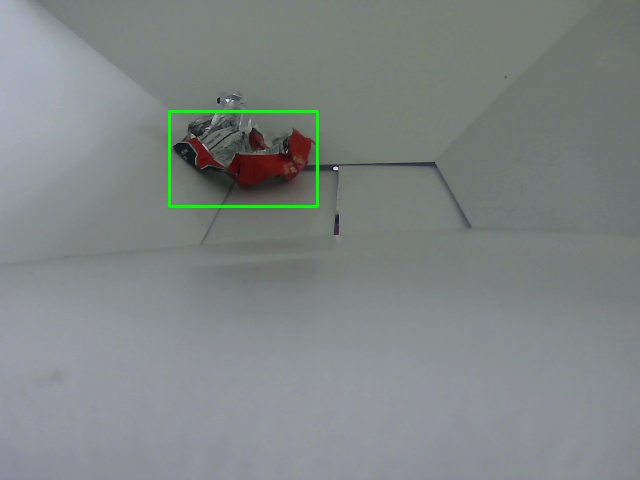

Object recognition using snack package samples.

---

## Secondary Can Detection

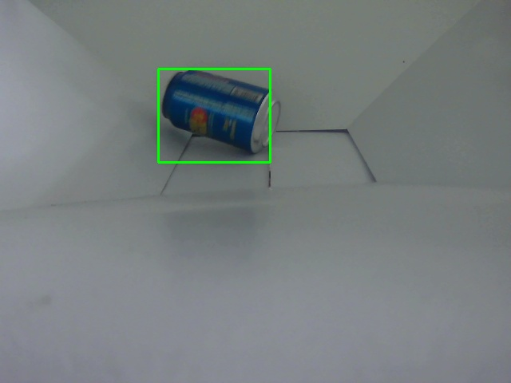

Additional metal can classification test.

---

# 8. Demonstration Videos

Videos available inside:

```text
media/Videos/
