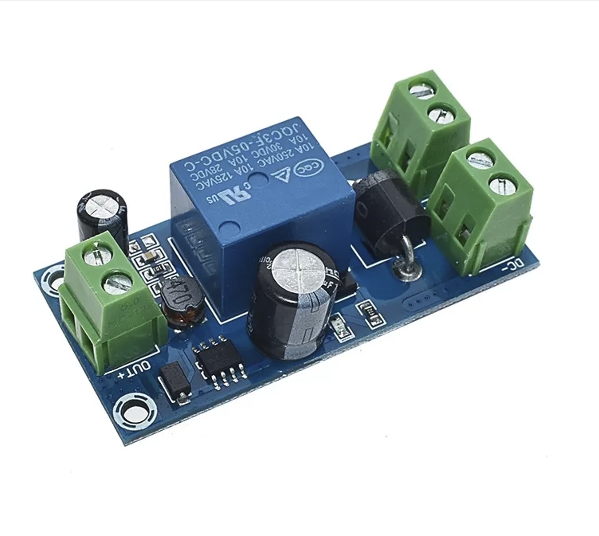
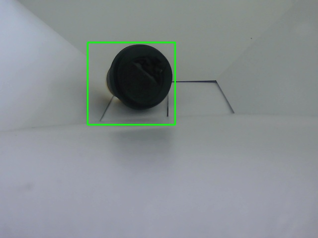

# GreenBin Smart Waste Sorting System

---

# Prototype Videos

## Computer Vision Demonstration
1. [Real-Time Computer Vision Test](https://youtu.be/gBCv70envV4?si=FGkhDpcO2gDX9rwH)

---

## SolidWorks Mechanical Animation
1. [SolidWorks System Animation](https://www.youtube.com/watch?v=Vz2Qn7ClXDQ)

---

## System Operation
1. [System Operation - Video 1](https://youtube.com/shorts/hdfvRof-kTo?si=nsPKkvwDemY0PTqk)

2. [System Operation - Video 2](https://youtube.com/shorts/4BFDa6KTnlE?si=5cehAOPIavr-avLs)

3. [System Operation - Video 3](https://youtube.com/shorts/-OyiT_zXJSk?si=_aoGU007zTufuVbw)

---

## Construction Process
1. [Construction Process - Video 1](https://youtube.com/shorts/FIJEmQkFpik?si=69EW74VwNNBN_zoi)

2. [Construction Process - Video 2](https://youtube.com/shorts/K8SWhSNdhhY?si=fuO97D4Np5HeXaKV)

---

# Final Prototype

## Final GreenBin Prototype


Final physical implementation of the GreenBin smart waste sorting system.

---

# System Design

## SolidWorks Prototype


Initial 3D design developed in SolidWorks.

---

# System Logic

## Development Whiteboard


Development logic and communication workflow between Jetson Nano, Arduino, sensors, and actuators.

---

## Mechanical Construction


Mechanical structure manufacturing and assembly process.

---

# Embedded System

## NVIDIA Jetson Nano


Embedded AI computer used for object detection and classification.

---

## Power System


Power distribution system with fuses and electronic integration with the Nano Jetson.

---

# Electronics and Components

## IBT-2 Motor Driver


Motor driver used to provide power and movement control for the linear actuators through Arduino commands.

---

## Linear Actuator


Linear actuator used to allow waste to pass into its corresponding compartment.

---

# Mechanical System

## Pulley Transmission System


Pulley and stepper motor transmission mechanism used to position the internal waste container.

---

# Electrical System

## Emergency Electrical and Backup Power System


Electrical protection and emergency energy distribution system.

The system included an automatic backup power module connected to the AC power line and a DC battery system.

If the main AC power source failed, GreenBin automatically switched to battery power to continue operating safely.



---

# Additional Mechanical Elements

## Acrylic Leachate Tray


Acrylic tray designed to collect leachates and liquids generated by waste inside the system.

The structure helped protect the internal mechanical and electronic components from liquid exposure.

---

# Computer Vision

## Camera Prototype


Model of camera used for waste detection: Klipxtreme Laguham (KWC-500)

The vision system detected objects using bounding boxes before sending the image to the OpenAI API with the GPT-4o model.

The AI model classified the detected waste into the following categories:

- Organic
- Recyclable
- Non-recyclable
- Biological risk

Prompt used in the system:

```python
"Clasifica el residuo como orgánico, aprovechable, no aprovechable o riesgo biológico."
```

---

# Object Detection Tests

The following images show object detection experiments performed using the computer vision system.

---

## Can Detection


---

## Sponge Detection


---

## Coffee Container Detection



---

## Orange Detection


---

## Syringe Detection


---

## Snack Package Detection


---

## Secondary Can Detection


---

## Tape Detection


---

## Jumper Detection


